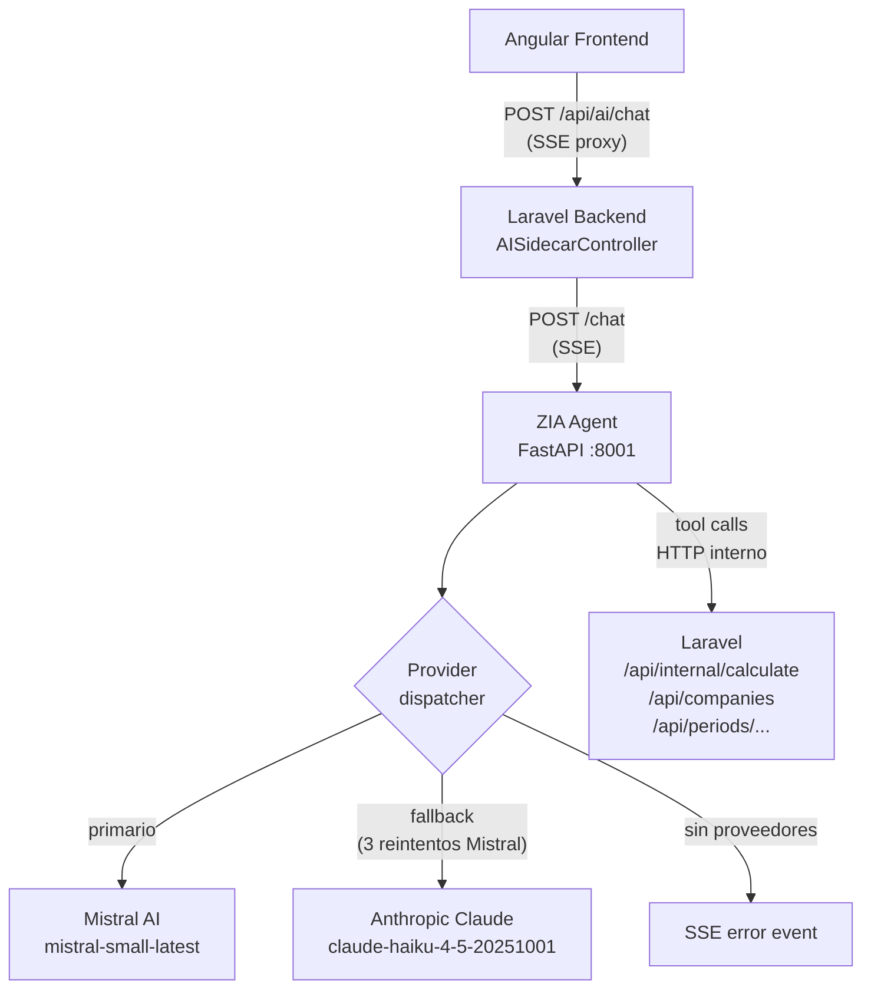
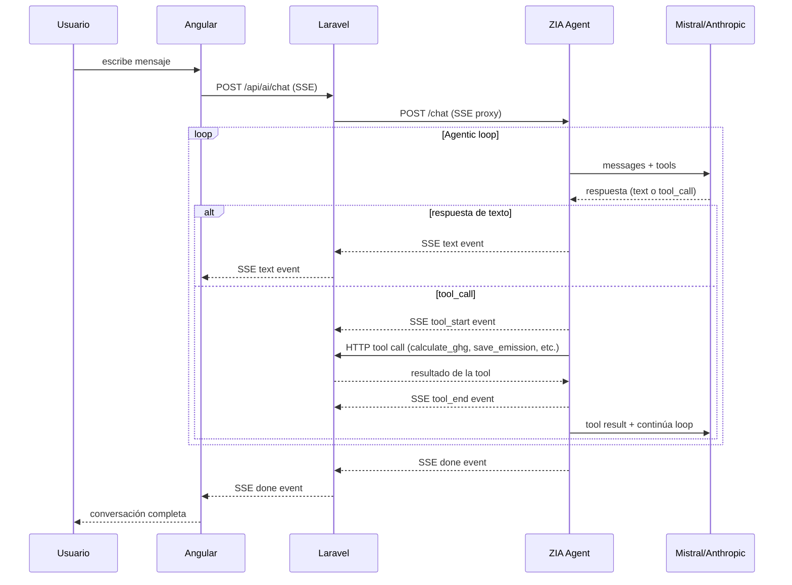

# ZIA Agent — Arquitectura del agente conversacional

**Última actualización:** 2026-06-29 | **Responsable:** Arquitecto / AWS Architect  
**Servicio:** `zia-agent` · FastAPI Python 3.12 · Puerto 8001

---

## Propósito

ZIA es un agente conversacional de captura de emisiones de carbono. Guía al usuario (responsable de sostenibilidad o de operaciones) para registrar correctamente las fuentes de emisión de su empresa, siguiendo el Protocolo GHG (Alcances 1, 2 y 3). **Nunca calcula tCO₂e directamente en texto** — siempre usa las tools del backend para garantizar exactitud y trazabilidad.

---

## Arquitectura de proveedores



### Selección de proveedor

1. Si `MISTRAL_API_KEY` está configurada → usa Mistral como primario
2. En caso de error → reintenta hasta 3 veces con backoff exponencial (1s, 2s)
3. Después de 3 fallos → emite SSE `warning` y cae a Anthropic
4. Si tampoco hay `ANTHROPIC_API_KEY` → emite SSE `error` y termina
5. Si ninguna key está configurada → HTTP 503 inmediato

El modelo de Mistral es configurable via `MISTRAL_MODEL` (default: `mistral-small-latest`).

---

## Flujo del agentic loop



---

## Tools disponibles (MCP)

El agente dispone de 6 tools que mapean a endpoints del backend Laravel.

### `get_company_profile`

Obtiene el perfil de la empresa: nombre, sector, período activo, empleados, m².

```python
# Input
{ "company_id": 3 }

# Calls
GET /api/companies  →  filtra por company_id
GET /api/companies/{id}/periods  →  busca período con status='active'

# Output
{
  "id": 3, "name": "ECONOVA", "sector_code": "servicios",
  "num_employees": 45, "floor_sqm": 800.0,
  "active_period_id": 7, "active_period_year": 2024
}
```

**Cuándo usarla:** Siempre como primera llamada al inicio de una conversación nueva.

---

### `get_questionnaire`

Devuelve las preguntas de captura aplicables al sector de la empresa.

```python
# Input
{ "sector_code": "servicios", "scope_filter": [1, 2] }  # scope_filter opcional

# Calls
GET /api/dictionaries/questionnaire?sector=servicios

# Output — array de preguntas
[
  {
    "emission_factor_id": 5,
    "questionnaire_label": "¿Cuántos kWh de electricidad consumió?",
    "is_required": true, "scope_id": 2, "scope_name": "Alcance 2"
  }
]
```

---

### `get_emission_factors`

Lista factores de emisión filtrados por alcance o categoría.

```python
# Input
{ "scope_id": 1, "category_name": "Refrigerantes" }  # ambos opcionales

# Calls
GET /api/dictionaries/factors?scope_id=1

# Output — array de factores con nombre, unidad y categoría
```

**Cuándo usarla:** Cuando el usuario menciona una fuente específica y hay que confirmar el factor correcto antes de calcular.

---

### `calculate_ghg`

Calcula las emisiones en tCO₂e para una actividad. **Nunca calcular manualmente — siempre usar esta tool.**

```python
# Input
{
  "emission_factor_id": 5,
  "monthly_values": [80.0, 90.0, 85.0, 92.0, 88.0, 91.0, 87.0, 95.0, 89.0, 93.0, 86.0, 97.0]
}

# Calls
POST /api/internal/calculate  (X-Internal-Secret requerido)

# Output
{
  "calculated_co2e": 0.4201,
  "activity_data_total": 1073.0,
  "emissions_co2": 0.4140,
  "emissions_ch4": 0.0038,
  "emissions_n2o": 0.0023,
  "uncertainty_result": 3.21
}
```

---

### `save_emission`

Persiste la emisión calculada en la base de datos. **Solo llamar después de mostrar el resultado al usuario y recibir confirmación explícita.**

```python
# Input
{
  "period_id": 7,
  "emission_factor_id": 5,
  "quantity": 1073.0,
  "calculated_co2e": 0.4201,
  "notes": "Electricidad red nacional — año completo 2024"
}

# Calls
POST /api/periods/{period_id}/emissions

# Output
{ "id": 42, "calculated_co2e": 0.4201, ... }
```

---

### `get_pending_questions`

Compara el cuestionario del sector con las emisiones ya registradas. Devuelve las fuentes que faltan.

```python
# Input
{ "company_id": 3, "period_id": 7, "sector_code": "servicios" }

# Calls
GET /api/dictionaries/questionnaire?sector=servicios
GET /api/periods/{period_id}/emissions

# Output
{
  "pending": [
    { "emission_factor_id": 8, "questionnaire_label": "Consumo de agua", "is_required": false, "scope_name": "Alcance 3" }
  ],
  "total": 6,
  "remaining": 1
}
```

**Cuándo usarla:** Al inicio y al final de cada sesión para guiar al usuario proactivamente hacia un inventario completo.

---

## Normalización de historial (Mistral ↔ Anthropic)

Los dos proveedores usan formatos incompatibles para tool calls en el historial de conversación. ZIA normaliza automáticamente antes de cada llamada al LLM:

| Formato Mistral/OpenAI | Formato Anthropic |
|---|---|
| `{"role": "assistant", "tool_calls": [...]}` | `{"role": "assistant", "content": [{"type": "tool_use", ...}]}` |
| `{"role": "tool", "content": "...", "tool_call_id": "..."}` | `{"role": "user", "content": [{"type": "tool_result", ...}]}` |

Ambas funciones son **idempotentes**: si el historial ya está en el formato correcto, pasa sin modificación. Esto permite cambiar de proveedor mid-sesión sin corrupción del historial.

```python
# zia-agent/main.py
normalize_history_for_anthropic(messages)  # antes de llamar a Anthropic
normalize_history_for_mistral(messages)    # antes de llamar a Mistral
```

---

## Eventos SSE

El agente emite Server-Sent Events durante el procesamiento. El formato de cada evento es:

```
data: {"type": "<tipo>", ...}\n\n
```

| Tipo | Payload adicional | Descripción |
|---|---|---|
| `text` | `"content": "..."` | Texto parcial del agente (streaming por fragmentos) |
| `tool_start` | `"tool": "...", "input": {...}` | El agente va a ejecutar una tool |
| `tool_end` | `"tool": "..."` | La tool terminó de ejecutarse |
| `warning` | `"message": "..."` | Alerta no fatal (ej. cambio de proveedor) |
| `error` | `"message": "..."` | Error irrecuperable |
| `done` | — | El agente terminó su turno |

El Angular frontend escucha estos eventos via `EventSource` y los renderiza progresivamente en el chat.

---

## Endpoints del servicio

### POST /chat

Endpoint principal — recibe la solicitud y retorna SSE stream.

```json
// Request body (enviado por AISidecarController, no directamente por el usuario)
{
  "message": "¿Cuánto CO₂ emití este año?",
  "company_id": 3,
  "period_id": 7,
  "history": [ ... ],
  "auth_token": "eyJ..."
}
```

### GET /health

```json
// Response 200
{
  "status": "ok",
  "service": "zia-agent",
  "primary": "mistral",
  "fallback": "anthropic",
  "providers_ready": ["mistral", "anthropic"]
}
```

---

## Tests

```bash
cd zia-agent
source .venv/bin/activate
pytest                          # 51 tests
pytest tests/test_history_normalization.py   # 16 tests de normalización Mistral↔Anthropic
```

**Cobertura:** Agentic loops (Mistral y Anthropic), ejecución de tools, normalización de historial, round-trip Mistral→Anthropic→Mistral, manejo de errores y tool desconocida.
