# ZIA Carbon Control — Modelo de datos

**Última actualización:** 2026-06-29 | **Responsable:** Arquitecto

---

## Diagrama ER

```mermaid
erDiagram
    users {
        id bigint PK
        name string
        email string UK
        password string
        role enum "superadmin|admin|user"
        deleted_at timestamp
    }
    companies {
        id bigint PK
        name string
        nit string
        company_sector_id bigint FK
        logo_url string
        floor_sqm decimal
        num_employees integer
        deleted_at timestamp
    }
    company_user {
        user_id bigint FK
        company_id bigint FK
        role string "admin|user"
        is_active boolean
    }
    company_sectors {
        id bigint PK
        name string
        code string UK
        description text
        deleted_at timestamp
    }
    periods {
        id bigint PK
        company_id bigint FK
        year integer
        status enum "open|active|closed"
        deleted_at timestamp
    }
    scopes {
        id bigint PK
        name string "Alcance 1|2|3"
        description text
        documentation_text text
        deleted_at timestamp
    }
    emission_categories {
        id bigint PK
        scope_id bigint FK
        parent_id bigint FK "nullable, self-ref"
        name string
        description text
        deleted_at timestamp
    }
    measurement_units {
        id bigint PK
        name string
        symbol string UK
        deleted_at timestamp
    }
    calculation_formulas {
        id bigint PK
        name string UK
        expression text
        variables json
        description text
        deleted_at timestamp
    }
    emission_factors {
        id bigint PK
        emission_category_id bigint FK
        measurement_unit_id bigint FK
        calculation_formula_id bigint FK "nullable"
        name string
        factor_co2 decimal
        factor_ch4 decimal
        factor_n2o decimal
        factor_nf3 decimal
        factor_sf6 decimal
        factor_total_co2e decimal
        uncertainty_lower decimal
        uncertainty_upper decimal
        source_reference text
        deleted_at timestamp
    }
    carbon_emissions {
        id bigint PK
        period_id bigint FK
        emission_factor_id bigint FK
        quantity decimal
        calculated_co2e decimal
        notes text
        deleted_at timestamp
    }
    company_emission_factor {
        company_id bigint FK
        emission_factor_id bigint FK
        is_enabled boolean
    }
    company_groups {
        id bigint PK
        name string
        description text
        created_by bigint FK
        deleted_at timestamp
    }
    company_group_members {
        group_id bigint FK
        company_id bigint FK
        joined_at timestamp
    }
    sector_questionnaire_rules {
        id bigint PK
        sector_code string
        emission_factor_id bigint FK
        questionnaire_label string
        is_required boolean
        scope_id bigint FK
        scope_name string
    }
    iot_devices {
        id bigint PK
        company_id bigint FK
        emission_factor_id bigint FK
        thingsboard_id string
        device_type string "energy|water"
        name string
        deleted_at timestamp
    }
    telemetry_readings {
        id bigint PK
        device_id bigint FK
        value decimal
        unit string
        read_at timestamp
    }
    telemetry_alerts {
        id bigint PK
        device_id bigint FK
        alert_type string "warning|critical"
        value decimal
        threshold decimal
        triggered_at timestamp
    }
    activity_logs {
        id bigint PK
        user_id bigint FK
        subject_type string
        subject_id bigint
        description text
        properties json
        created_at timestamp
    }

    users ||--o{ company_user : ""
    companies ||--o{ company_user : ""
    companies }o--|| company_sectors : "sector"
    companies ||--o{ periods : ""
    companies ||--o{ iot_devices : ""
    companies ||--o{ company_emission_factor : ""
    emission_factors ||--o{ company_emission_factor : ""
    periods ||--o{ carbon_emissions : ""
    emission_factors ||--o{ carbon_emissions : ""
    emission_factors }o--|| emission_categories : ""
    emission_factors }o--|| measurement_units : ""
    emission_factors }o--o| calculation_formulas : "opcional"
    emission_factors ||--o{ sector_questionnaire_rules : ""
    emission_factors }o--o| iot_devices : ""
    emission_categories }o--|| scopes : ""
    emission_categories }o--o| emission_categories : "parent"
    company_groups ||--o{ company_group_members : ""
    companies ||--o{ company_group_members : ""
    users ||--o{ company_groups : "created_by"
    iot_devices ||--o{ telemetry_readings : ""
    iot_devices ||--o{ telemetry_alerts : ""
    users ||--o{ activity_logs : ""
```

---

## Descripción de entidades

### `users` — Usuarios

Usuarios de la plataforma. El campo `role` es el rol global; el rol contextual por empresa vive en el pivot `company_user`.

| Campo | Tipo | Descripción |
|---|---|---|
| `role` | enum | `superadmin` — acceso total; `admin` — gestiona sus empresas; `user` — captura datos |

Usa **SoftDeletes**. El flujo de restore (reactivar usuario eliminado con el mismo email) está soportado en `AdminUserController::store`.

---

### `companies` — Empresas

Unidad principal de aislamiento de datos. Cada empresa tiene su propio conjunto de períodos, emisiones y factores habilitados.

| Campo | Descripción |
|---|---|
| `nit` | NIT o número de identificación fiscal |
| `floor_sqm` | Área de oficinas (m²), usado por el agente ZIA |
| `num_employees` | Número de empleados, usado por el agente ZIA |
| `company_sector_id` | Sector económico — determina el cuestionario GHG aplicable |

---

### `company_user` — Pivot usuario↔empresa

Un usuario puede pertenecer a múltiples empresas con roles distintos.

| Campo | Descripción |
|---|---|
| `role` | Rol en esta empresa específica: `admin` \| `user` |
| `is_active` | Si la membresía está activa |

El middleware `context.aware` usa este pivot junto con `X-Company-ID` para validar acceso contextual.

---

### `periods` — Períodos de medición

Un período representa un año fiscal de inventario GHG para una empresa.

| Campo | Descripción |
|---|---|
| `year` | Año del inventario (ej. 2024) |
| `status` | `open` — en captura; `active` — período activo vigente; `closed` — cerrado |

Solo puede haber un período `active` por empresa en un momento dado (restricción de negocio, no de BD).

---

### `scopes` — Alcances GHG

Los tres alcances del Protocolo GHG, sembrados en la BD (no se crean en runtime).

| ID | Nombre | Descripción |
|---|---|---|
| 1 | Alcance 1 | Emisiones directas (combustión in situ, vehículos propios) |
| 2 | Alcance 2 | Electricidad y energía comprada |
| 3 | Alcance 3 | Cadena de valor (viajes, residuos, compras) |

---

### `emission_categories` — Categorías de fuentes

Agrupan factores de emisión bajo un alcance. Soportan jerarquía (campo `parent_id` auto-referencial).

Ejemplos: "Fuentes Móviles — Gasolina" (Alcance 1), "Electricidad Red Colombia" (Alcance 2).

---

### `emission_factors` — Factores de emisión

El núcleo del motor de cálculo. Cada factor almacena coeficientes por gas (GWP AR6) y opcionalmente apunta a una fórmula dinámica.

| Campo | Descripción |
|---|---|
| `factor_co2/ch4/n2o/nf3/sf6` | kg de gas por unidad de actividad |
| `factor_total_co2e` | Valor precalculado (fallback cuando todos los factores por gas son 0) |
| `calculation_formula_id` | Si existe, la fórmula sobreescribe el cálculo estándar GWP |
| `uncertainty_lower/upper` | Rango de incertidumbre en % |

Cálculo estándar: `CO2e = Σ(factor_gas × GWP_gas) × activity_data / 1000`
GWP AR6: CO₂=1, CH₄=28, N₂O=265, NF₃=16100, SF₆=23500

---

### `calculation_formulas` — Fórmulas dinámicas

Expresiones evaluadas en runtime (Python `eval` seguro) que sobreescriben el cálculo GWP estándar.

| Campo | Descripción |
|---|---|
| `expression` | Expresión matemática, ej: `(activity_data * factor_co2) / 1000` |
| `variables` | JSON con metadatos de variables disponibles |

Variables disponibles en expresiones: `activity_data`, `factor_co2`, `factor_ch4`, `factor_n2o`, `factor_nf3`, `factor_sf6`, `factor_total_co2e`, `gwp_co2`, `gwp_ch4`, `gwp_n2o`. El operador `^` se reescribe a `**` (compatibilidad Excel).

---

### `carbon_emissions` — Emisiones registradas

Cada registro es el resultado de una captura de actividad calculada en tCO₂e.

| Campo | Descripción |
|---|---|
| `quantity` | Dato de actividad total (suma de valores mensuales si aplica) |
| `calculated_co2e` | Resultado del cálculo en toneladas de CO₂ equivalente |
| `notes` | Descripción libre de la fuente (ej. "Electricidad enero-junio 2024") |

---

### `company_emission_factor` — Factores habilitados por empresa

Pivot que permite a cada empresa activar o desactivar factores del catálogo global.

| Campo | Descripción |
|---|---|
| `is_enabled` | `true` = el factor aparece en el cuestionario y formularios de la empresa |

---

### `sector_questionnaire_rules` — Cuestionario GHG por sector

Mapea qué factores de emisión son aplicables a cada sector económico, con su etiqueta de pregunta.

| Campo | Descripción |
|---|---|
| `sector_code` | Código del sector: `servicios`, `industria`, `transporte`, `energia`, `publico`, `tecnologia` |
| `questionnaire_label` | Pregunta que ve el usuario, ej: "¿Cuántos galones de gasolina consumió?" |
| `is_required` | Si el factor es obligatorio para el inventario del sector |

El agente ZIA usa esta tabla en la tool `get_questionnaire` para guiar la captura.

---

### `company_groups` + `company_group_members` — Grupos de empresas

Permite agrupar varias empresas (ej. empresas en el mismo edificio) para análisis agregado de huella de carbono. Solo accesible para `superadmin`.

El pivot `company_group_members` solo tiene `joined_at` (sin `created_at`/`updated_at`).

---

### `iot_devices` + `telemetry_readings` + `telemetry_alerts` — IoT

Dispositivos de medición continua conectados a ThingsBoard. El cron `zia:sync-telemetry` lee las lecturas y genera `CarbonEmission` automáticamente, y dispara alertas si supera umbrales configurados.

---

### `activity_logs` — Auditoría

Registro automático de acciones sobre modelos (via trait `LogsActivity`). Guarda quién hizo qué y cuándo, incluyendo los valores antes/después en `properties`.
