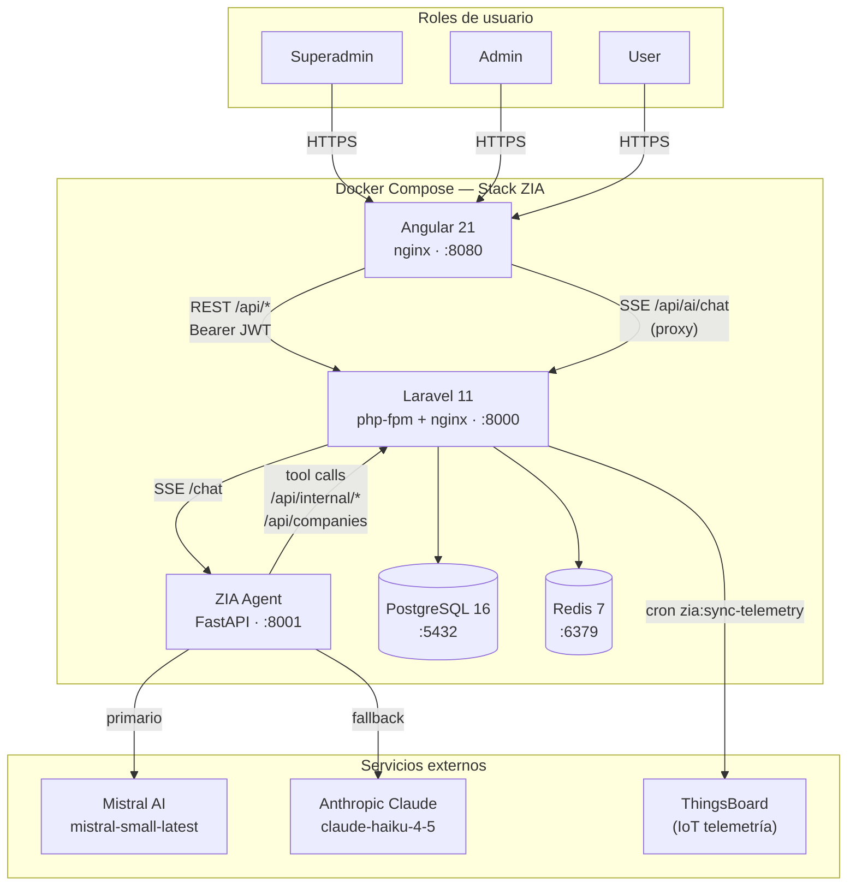

# ZIA Carbon Control — Arquitectura del sistema

**Última actualización:** 2026-06-29 | **Responsable:** Arquitecto

---

## ¿Qué es ZIA Carbon Control?

Plataforma de gestión de huella de carbono corporativa que permite a las empresas capturar, calcular y reportar sus emisiones de gases de efecto invernadero (GEI) siguiendo el **Protocolo GHG** (Alcances 1, 2 y 3). Incluye un agente de IA conversacional (ZIA) que guía al usuario en la captura de datos.

---

## Stack tecnológico

| Capa | Tecnología | Versión |
|---|---|---|
| Frontend SPA | Angular | 21 |
| Backend API | Laravel | 11 (PHP 8.4) |
| Agente IA | FastAPI | Python 3.12 |
| Base de datos | PostgreSQL + pgvector | 16 (`pgvector/pgvector:pg16`) |
| Caché / colas | Redis | 7 |
| IA primaria | Mistral AI | `mistral-small-latest` (configurable) |
| IA fallback | Anthropic Claude | `claude-haiku-4-5` |
| Embeddings (RAG) | Mistral AI | `mistral-embed` (1024 dim) |
| IoT telemetría | ThingsBoard | Cloud (mock en dev) |
| Orquestación | Docker Compose | — |

---

## Diagrama de componentes



---

## Flujo de datos principal

### Captura de emisiones (flujo estándar)

```
Usuario → Angular form → POST /api/periods/{id}/emissions
       → CarbonEmissionController → CarbonFootprintService
       → calcula CO2e con GWP (AR6) o fórmula dinámica
       → persiste en carbon_emissions
```

### Captura asistida por IA (flujo ZIA)

```
Usuario → Angular chat → POST /api/ai/chat
       → AISidecarController (SSE proxy)
       → zia-agent FastAPI
       → agentic loop (Mistral / Anthropic)
       → tools: get_company_profile, get_questionnaire,
                get_emission_factors, calculate_ghg, save_emission
       → tools llaman a /api/internal/calculate y /api/periods/{id}/emissions
       → SSE events streamed de vuelta al browser
```

### Ingesta IoT

```
Cron (cada 15 min) → zia:sync-telemetry command
                  → ThingsBoardService (o mock en dev)
                  → lee lecturas de energía y agua
                  → convierte a CarbonEmission automáticamente
                  → genera TelemetryAlert si supera umbrales
```

### RAG de documentos (agente ZIA)

```
Usuario sube documento → CompanyDocumentController → ProcessCompanyDocument (job en cola)
                       → DocumentTextExtractor (pdfparser / texto plano)
                       → TextChunker (~800 chars, con overlap)
                       → POST /embed en zia-agent (mistral-embed)
                       → guarda DocumentChunk (contenido + embedding)

Usuario pregunta al chat → tool search_company_documents
                        → POST /api/internal/search-documents
                        → similarity search (coseno, en PHP, acotado por company_id)
                        → chunks relevantes de vuelta al agente
```

---

## Roles y permisos

| Rol | Descripción | Acceso |
|---|---|---|
| `superadmin` | Administrador global de la plataforma | Todo: empresas, sectores, factores de emisión, fórmulas, usuarios, grupos |
| `admin` | Administrador de una o más empresas | Gestión de usuarios y emisiones de sus empresas asignadas |
| `user` | Responsable de sostenibilidad o de operaciones | Captura de emisiones y consulta de dashboard de sus empresas |

El rol se verifica mediante el middleware `role:{roles}` (header `X-Context-Role` o campo `users.role`). Las rutas bajo `/api/admin/` requieren `admin` o `superadmin`. Las rutas bajo `/api/admin/groups` y los endpoints de master data requieren `superadmin`.

---

## Estructura del monorepo

```
ZiaMonorepo/
├── backend/           Laravel 11 — API REST + motor de cálculo GEI
│   ├── app/
│   │   ├── Http/Controllers/Api/       Controladores REST
│   │   ├── Models/                     16 modelos Eloquent
│   │   └── Services/                   CarbonFootprintService, FormulaEvaluationService, AI, IoT
│   ├── database/migrations/            30 migraciones (historia completa del esquema)
│   └── tests/                          176 tests (Unit + Feature)
│
├── frontend/          Angular 21 SPA
│   └── src/app/
│       ├── components/                 Dashboard, Form, SmartIntake, ZiaChat, Admin
│       └── services/                   auth, carbon, dashboard, master-data, context, theme
│
├── zia-agent/         FastAPI Python — agente conversacional con tool use
│   ├── main.py                         Agentic loop Mistral/Anthropic + 6 MCP tools
│   └── tests/                          51 tests (pytest)
│
├── docs/              Documentación comiteada del producto
│   ├── architecture/  Visión técnica del sistema
│   ├── guides/        Guías de desarrollo y operación
│   └── ops/           Infraestructura y variables de entorno
│
├── docker-compose.yml       Stack de producción / staging
└── docker-compose.dev.yml   Overlay de desarrollo con hot-reload
```

---

## Modelo de datos (resumen)

Ver [`data-model.md`](data-model.md) para el diagrama ER completo.

| Entidad | Descripción |
|---|---|
| `users` | Usuarios con rol global (superadmin / admin / user) |
| `companies` | Empresas cliente con sector y datos de contacto |
| `company_user` | Pivot user↔company con rol contextual |
| `periods` | Período anual de medición por empresa |
| `scopes` | Alcances GHG (1 = directo, 2 = electricidad, 3 = indirecto) |
| `emission_categories` | Categorías de fuentes de emisión por alcance |
| `emission_factors` | Factores de emisión con valores GWP por gas (CO₂, CH₄, N₂O, NF₃, SF₆) |
| `carbon_emissions` | Registro de emisión calculada: actividad × factor → tCO₂e |
| `calculation_formulas` | Fórmulas dinámicas opcionales (expresiones evaluadas en runtime) |
| `measurement_units` | Unidades de medida (kWh, Gal, m³, kg...) |
| `company_sectors` | Sectores económicos para agrupación y cuestionarios |
| `sector_questionnaire_rules` | Mapea preguntas del cuestionario a factores de emisión por sector |
| `company_groups` + `company_group_members` | Grupos de empresas para análisis agregado (ej. edificio) — solo superadmin |
| `telemetry_readings` + `telemetry_alerts` | Lecturas IoT y alertas automáticas de consumo |
| `company_documents` + `document_chunks` | Documentos subidos por empresa (facturas, certificados) y sus chunks con embedding para el RAG del agente |
| `activity_logs` | Auditoría de acciones de usuario |
