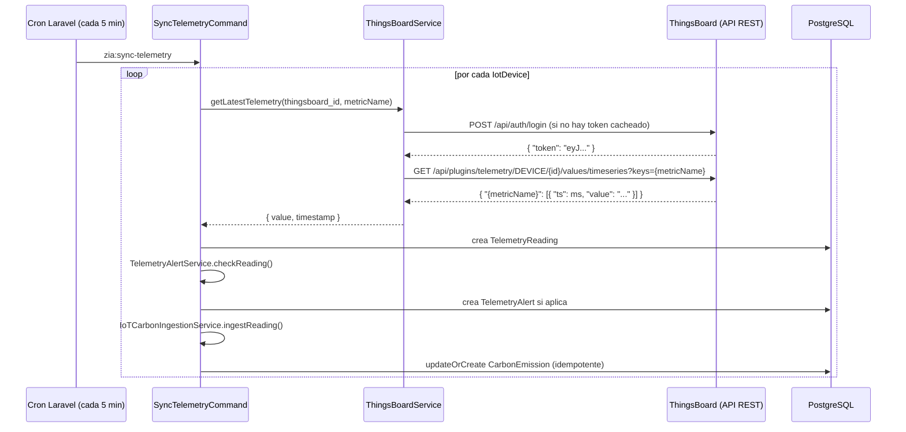

# Integración IoT vía ThingsBoard

**Última actualización:** 2026-07-05 | **Responsable:** Backend Dev / Emanuel (líder IoT)
**Servicio:** `ThingsBoardService` + comando `zia:sync-telemetry` (Laravel)

---

## Propósito

Zia no construye su propio broker MQTT ni base de datos de series de
tiempo — consulta periódicamente la API REST de una instancia de
**ThingsBoard** (existente, gestionada por el equipo IoT) para traer
lecturas de consumo (energía, agua) y convertirlas automáticamente en
registros de huella de carbono (`CarbonEmission`), con alertas cuando
el consumo se sale de lo esperado.

## Estado actual de este entorno

**Corre en modo simulado (`THINGSBOARD_MOCK=true`, valor por defecto en
`.env`/`.env.example`).** El código de la integración real existe y es
funcional (`ThingsBoardService::getLatestTelemetry()`), pero mientras
`THINGSBOARD_MOCK` sea `true`, cada lectura se genera con datos
sintéticos (`generateMockTelemetry()`) que simulan un patrón realista
de consumo (más alto en horario laboral, con un 5% de probabilidad de
simular un pico anómalo para poder probar las alertas).

Este documento describe **cómo debe configurarse y qué debe pasar
cuando se conecta a una instancia real** — no requiere cambios de
código, solo configuración y que el equipo IoT tenga dispositivos
publicando en ThingsBoard.

---

## Diagrama de flujo



---

## Endpoint 1 — Autenticación

```
POST {THINGSBOARD_HOST}/api/auth/login
Content-Type: application/json

{
  "username": "{THINGSBOARD_USERNAME}",
  "password": "{THINGSBOARD_PASSWORD}"
}
```

**Respuesta esperada (200)**:
```json
{ "token": "eyJhbGciOiJIUzI1NiJ9...", "refreshToken": "..." }
```

El token se cachea 55 segundos (`Cache::remember('thingsboard_jwt_token', 55, ...)`)
para no re-autenticar en cada lectura. Si la autenticación falla
(credenciales inválidas, host inalcanzable), el servicio **cae
automáticamente a datos simulados** para esa lectura puntual y registra
un `Log::error` — no interrumpe el resto del cron.

## Endpoint 2 — Última lectura de telemetría

```
GET {THINGSBOARD_HOST}/api/plugins/telemetry/DEVICE/{deviceId}/values/timeseries?keys={metricName}
X-Authorization: Bearer {token}
```

- `{deviceId}` = el UUID del dispositivo **tal como está registrado en
  ThingsBoard** — debe coincidir exactamente con el campo
  `iot_devices.thingsboard_id` en la base de datos de Zia
- `{metricName}` = el nombre de la key de telemetría en ThingsBoard.
  **Hoy está hardcodeado en `SyncTelemetryCommand`**: `electricity_kwh`
  para dispositivos `type='energy'`, `water_m3` para `type='water'`

**Respuesta esperada (200)** — formato estándar de ThingsBoard:
```json
{
  "electricity_kwh": [
    { "ts": 1783267200000, "value": "67.4" }
  ]
}
```
Solo se usa el primer elemento del array (la lectura más reciente).
`ts` viene en **milisegundos** (ThingsBoard estándar); el servicio lo
convierte a un timestamp de PHP dividiendo entre 1000.

Si la respuesta no trae la key esperada, o la request falla por
cualquier razón (timeout, 401, 500), el servicio registra un
`Log::warning`/`Log::error` y **cae a datos simulados** para esa
lectura — el cron nunca se detiene por un dispositivo con problemas.

---

## Qué debe estar configurado para operar en modo real

1. **Variables de entorno** (`backend/.env`):
   ```
   THINGSBOARD_MOCK=false
   THINGSBOARD_HOST=https://<tu-instancia>.thingsboard.cloud   # o self-hosted
   THINGSBOARD_USERNAME=<usuario con permiso de lectura de telemetría>
   THINGSBOARD_PASSWORD=<contraseña>
   ```

2. **Cada `IotDevice` en la base de datos de Zia** debe tener su
   `thingsboard_id` apuntando al UUID real del dispositivo en
   ThingsBoard (`Administración → Dispositivos IoT`, o directo en BD).

3. **El dispositivo en ThingsBoard debe estar publicando telemetría
   bajo exactamente las keys `electricity_kwh` o `water_m3`** (según el
   `type` del dispositivo en Zia). Si el dispositivo real de
   ThingsBoard usa otro nombre de key (ej. `power_consumption`), hay
   que ajustar el mapeo en `SyncTelemetryCommand::handle()` (línea
   ~88: `$metricName = $device->type === 'energy' ? 'electricity_kwh' : 'water_m3';`)
   — esto es lo único que requeriría un cambio de código, y es
   deliberadamente simple de ajustar (una línea).

4. **El usuario de ThingsBoard usado en `THINGSBOARD_USERNAME`
   necesita permiso de lectura sobre esos dispositivos específicos**
   (scope de tenant o customer, según cómo esté organizado el
   ThingsBoard real — esto lo define el equipo IoT/Emanuel, dueño de
   la instancia según el SLA).

---

## Qué pasa con cada lectura una vez llega (siempre igual, mock o real)

1. **`TelemetryReading`** — se guarda la lectura cruda: `device_id`,
   `metric_name`, `value`, `timestamp`.

2. **`TelemetryAlertService::checkReading()`** — evalúa si la lectura
   es anómala (fuera de horario laboral + fin de semana/noche con
   consumo por encima de un umbral base). Si dispara, crea un
   `TelemetryAlert` (`alert_type`, `severity`, `threshold_value`,
   `actual_value`).

3. **`IoTCarbonIngestionService::ingestReading()`** — convierte la
   lectura en una emisión de carbono real:
   - Requiere que el dispositivo tenga `company_id` y
     `emission_factor_id` configurados; si falta alguno, la lectura se
     guarda pero no genera emisión (`return null`)
   - Busca el período `open`/`active` más reciente de esa empresa; sin
     período activo, no genera emisión
   - **Es idempotente**: re-suma TODAS las lecturas del dispositivo en
     el año del período (`TelemetryReading::where('device_id', ...)
     ->whereYear('timestamp', $period->year)->sum('value')`) y hace
     `updateOrCreate` sobre la emisión — correr el cron 100 veces no
     duplica ni infla el total, siempre recalcula desde cero
   - El resultado (`quantity × factor_total_co2e`) se guarda como
     `CarbonEmission` con nota `"Auto-ingested from IoT: {nombre del dispositivo}"`

---

## Cómo validar el modo mock vs real hoy

```bash
grep THINGSBOARD_MOCK backend/.env    # true = simulado, false = real
docker exec zia_backend php artisan zia:sync-telemetry   # correr el cron manualmente
```

En modo mock, los valores son sintéticos pero **siguen el mismo pipeline
completo** (lectura → alerta → emisión) — es una simulación fiel del
comportamiento real, útil para demos y para probar las alertas sin
depender de una instancia de ThingsBoard real.

---

## Referencias

- `backend/app/Services/ThingsBoardService.php` — cliente HTTP
- `backend/app/Console/Commands/SyncTelemetryCommand.php` — orquestación del cron (cada 5 min, `routes/console.php`)
- `backend/app/Services/TelemetryAlertService.php` — lógica de alertas
- `backend/app/Services/IoTCarbonIngestionService.php` — conversión a `CarbonEmission`
- `backend/database/migrations/2026_06_01_000000_create_telemetry_tables.php` — esquema de `iot_devices`, `telemetry_readings`, `telemetry_alerts`
- [Documentación oficial de la API de telemetría de ThingsBoard](https://thingsboard.io/docs/reference/rest-api/) — para verificar cambios de formato si se actualiza la versión de ThingsBoard
