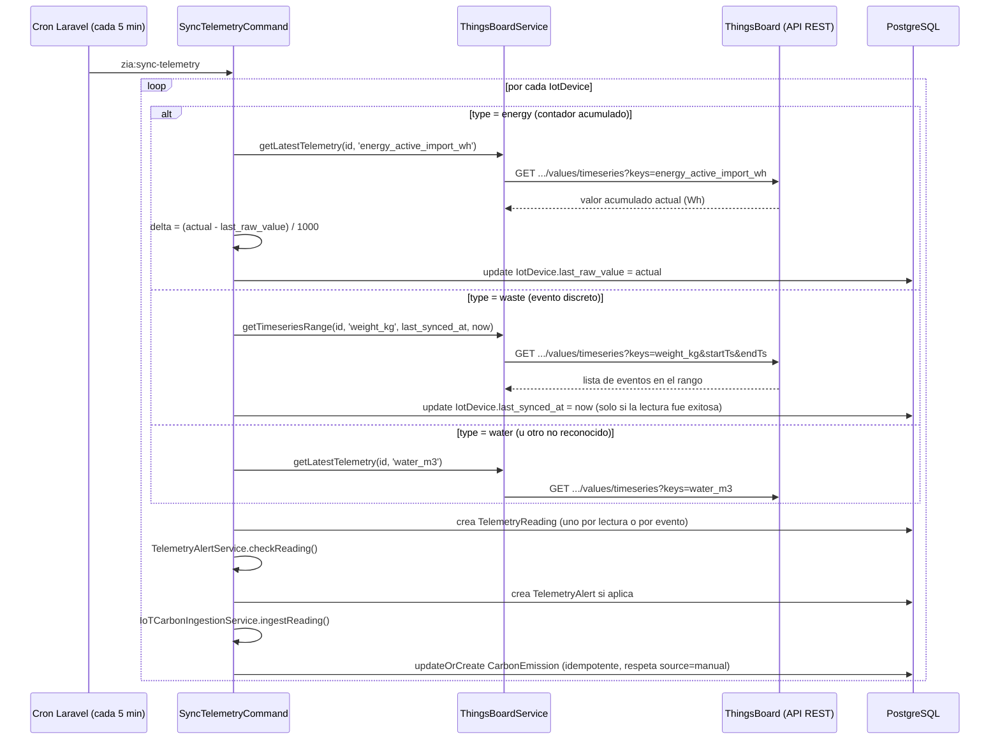

# Integración IoT vía ThingsBoard

**Última actualización:** 2026-07-17 | **Responsable:** Backend Dev / Emanuel (líder IoT)
**Servicio:** `ThingsBoardService` + comando `zia:sync-telemetry` (Laravel)

## Validado contra un tenant de prueba real (2026-07-17)

Se probó la conexión contra un tenant real de Meeldavlab
(`https://thingsboard.meeldavlab.xyz`, ThingsBoard **3.7.0 open-source**,
no PE). Hallazgos que corrigen supuestos anteriores de este documento:

- **JWT sigue siendo el mecanismo correcto.** La doc de ThingsBoard PE
  marca el login JWT como deprecated en favor de "API Keys" (desde 4.3),
  pero esta instancia es 3.7.0 y **no expone ningún endpoint de gestión
  de API Keys** (verificado contra su spec OpenAPI real en `/v3/api-docs`).
  No migrar el mecanismo de auth — no aplica acá.
- **El dispositivo de energía real no publica `electricity_kwh`.** Su key
  real es `energy_active_import_wh`: un **contador acumulado de por vida**
  (Wh desde la instalación del medidor), confirmado con el equipo de IoT.
  Por eso `SyncTelemetryCommand` ya no guarda el valor crudo de esa key —
  calcula el delta contra la última lectura conocida (ver sección
  "Semántica de cada tipo de dispositivo" abajo).
- El tenant de prueba también tenía un sensor de peso (`weight_kg`,
  pensado para papel/residuos) y una cámara — ninguno de los dos
  correspondía al modelo `energy`/`water` original. El sensor de peso
  **reporta por evento y resetea a 0 entre pesajes** (confirmado con el
  equipo de IoT), lo que llevó a agregar el tipo `waste` con una
  estrategia de sincronización distinta (rango de eventos, no "última
  lectura").

---

## Propósito

Zia no construye su propio broker MQTT ni base de datos de series de
tiempo — consulta periódicamente la API REST de una instancia de
**ThingsBoard** (existente, gestionada por el equipo IoT) para traer
lecturas de consumo (energía, agua) y convertirlas automáticamente en
registros de huella de carbono (`CarbonEmission`), con alertas cuando
el consumo se sale de lo esperado.

## Estado actual de este entorno

**Corre en modo simulado (`THINGSBOARD_MOCK=true`, valor por defecto en
`.env`/`.env.example`).** El código de la integración real existe y es
funcional (`ThingsBoardService::getLatestTelemetry()`), pero mientras
`THINGSBOARD_MOCK` sea `true`, cada lectura se genera con datos
sintéticos (`generateMockTelemetry()`) que simulan un patrón realista
de consumo (más alto en horario laboral, con un 5% de probabilidad de
simular un pico anómalo para poder probar las alertas).

Este documento describe **cómo debe configurarse y qué debe pasar
cuando se conecta a una instancia real** — no requiere cambios de
código, solo configuración y que el equipo IoT tenga dispositivos
publicando en ThingsBoard.

---

## Diagrama de flujo



---

## Semántica de cada tipo de dispositivo

El valor crudo que expone un sensor real no siempre es directamente "lo
que se consumió en este intervalo" — asumir eso sin confirmarlo fue la
causa de los dos ajustes de esta sección. `IoTCarbonIngestionService`
sigue sumando `TelemetryReading.value` de todo el año sin cambios; lo que
cambió es qué se guarda en `value` para cada tipo, para que esa suma siga
siendo correcta.

| `type` | Qué expone el sensor real | Qué guarda `SyncTelemetryCommand` en `TelemetryReading.value` |
|---|---|---|
| `energy` | Contador acumulado de por vida (`energy_active_import_wh`, Wh) | El **delta** contra `IotDevice.last_raw_value` (en kWh). Primera lectura tras conectar el dispositivo: delta = 0 (no hay línea base, se descarta en vez de contar de golpe todo el histórico del medidor) |
| `waste` | Evento discreto que resetea a 0 entre pesajes (`weight_kg`) | El valor de **cada evento** en el rango `[last_synced_at, now]` — un `TelemetryReading` por evento. "Última lectura" no sirve acá: puede caer justo entre dos eventos y perderlos |
| `water` (y cualquier tipo no reconocido) | Se asume que ya es el consumo del intervalo | El valor tal cual — comportamiento original, sin cambios. **No confirmado contra un dispositivo real** (el tenant de prueba no tenía sensor de agua) — si se conecta uno real, confirmar esta suposición antes de confiar en el total |

`CarbonEmission` tiene una columna `source` (`manual` | `iot`).
`IoTCarbonIngestionService` nunca sobreescribe una fila `source=manual`
— si una empresa ya tiene una emisión cargada a mano para el mismo
`[period_id, emission_factor_id]`, la lectura IoT se omite (con
`Log::warning`) en vez de pisarla en silencio.

---

## Endpoint 1 — Autenticación

```
POST {THINGSBOARD_HOST}/api/auth/login
Content-Type: application/json

{
  "username": "{THINGSBOARD_USERNAME}",
  "password": "{THINGSBOARD_PASSWORD}"
}
```

**Respuesta esperada (200)**:
```json
{ "token": "eyJhbGciOiJIUzI1NiJ9...", "refreshToken": "..." }
```

El token se cachea 55 segundos (`Cache::remember('thingsboard_jwt_token', 55, ...)`)
para no re-autenticar en cada lectura. Si la autenticación falla
(credenciales inválidas, host inalcanzable), el servicio **cae
automáticamente a datos simulados** para esa lectura puntual y registra
un `Log::error` — no interrumpe el resto del cron.

## Endpoint 2 — Última lectura de telemetría (energía, agua)

```
GET {THINGSBOARD_HOST}/api/plugins/telemetry/DEVICE/{deviceId}/values/timeseries?keys={metricName}
X-Authorization: Bearer {token}
```

- `{deviceId}` = el UUID del dispositivo **tal como está registrado en
  ThingsBoard** — debe coincidir exactamente con el campo
  `iot_devices.thingsboard_id` en la base de datos de Zia
- `{metricName}` = el nombre de la key de telemetría en ThingsBoard.
  **Hardcodeado en `SyncTelemetryCommand`**: `energy_active_import_wh`
  para `type='energy'` (confirmado contra un medidor real), `water_m3`
  para `type='water'` (sin confirmar contra un dispositivo real)

**Respuesta esperada (200)** — formato estándar de ThingsBoard:
```json
{
  "energy_active_import_wh": [
    { "ts": 1783267200000, "value": "4125.6" }
  ]
}
```
Solo se usa el primer elemento del array (la lectura más reciente).
`ts` viene en **milisegundos** (ThingsBoard estándar); el servicio lo
convierte a un timestamp de PHP dividiendo entre 1000.

Si la respuesta no trae la key esperada, o la request falla por
cualquier razón (timeout, 401, 500), el servicio registra un
`Log::warning`/`Log::error` y **cae a datos simulados** para esa
lectura — el cron nunca se detiene por un dispositivo con problemas.

## Endpoint 3 — Rango de telemetría (residuos, sensores por evento)

```
GET {THINGSBOARD_HOST}/api/plugins/telemetry/DEVICE/{deviceId}/values/timeseries?keys={metricName}&startTs={ms}&endTs={ms}&limit=1000
X-Authorization: Bearer {token}
```

Usado solo para `type='waste'` (`metricName = 'weight_kg'`), vía
`ThingsBoardService::getTimeseriesRange()`. A diferencia del endpoint 2,
trae **todos** los puntos del rango `[last_synced_at, now]`, no solo el
último — necesario porque el sensor resetea a 0 entre eventos y "última
lectura" puede perderse un pesaje que ya ocurrió y volvió a 0.

**No cae a datos simulados en caso de falla real** (fabricar eventos de
peso inventaría kg de residuos que no existieron). En su lugar devuelve
`null`, y `SyncTelemetryCommand` **no avanza** `IotDevice.last_synced_at`
— el mismo rango se reintenta en la siguiente corrida del cron en vez de
perderse.

---

## Qué debe estar configurado para operar en modo real

1. **Variables de entorno** (`backend/.env`):
   ```
   THINGSBOARD_MOCK=false
   THINGSBOARD_HOST=https://<tu-instancia>.thingsboard.cloud   # o self-hosted
   THINGSBOARD_USERNAME=<usuario con permiso de lectura de telemetría>
   THINGSBOARD_PASSWORD=<contraseña>
   ```

2. **Cada `IotDevice` en la base de datos de Zia** debe tener su
   `thingsboard_id` apuntando al UUID real del dispositivo en
   ThingsBoard (`Administración → Dispositivos IoT`, o directo en BD).

3. **El dispositivo en ThingsBoard debe estar publicando telemetría
   bajo exactamente las keys que espera cada tipo**: `energy_active_import_wh`
   para `type='energy'`, `water_m3` para `type='water'`, `weight_kg` para
   `type='waste'`. Si un dispositivo real usa otro nombre de key, hay que
   ajustar el mapeo correspondiente en `SyncTelemetryCommand` (los métodos
   `syncCumulativeEnergyDevice`, `syncEventBasedDevice`,
   `syncIntervalDevice`) — y confirmar con el equipo IoT si esa key es un
   contador acumulado, un evento discreto, o ya un valor de intervalo,
   porque de eso depende cuál de los tres métodos aplica (ver "Semántica
   de cada tipo de dispositivo" arriba).

4. **El usuario de ThingsBoard usado en `THINGSBOARD_USERNAME`
   necesita permiso de lectura sobre esos dispositivos específicos**
   (scope de tenant o customer, según cómo esté organizado el
   ThingsBoard real — esto lo define el equipo IoT/Emanuel, dueño de
   la instancia según el SLA).

> Nota de implementación: `ThingsBoardService` resuelve host/usuario/
> contraseña de forma perezosa (recién al hacer una llamada real), no en
> su constructor — el constructor se puede resolver durante el bootstrap
> de artisan de *cualquier* comando (via `Schedule::command` en
> `routes/console.php`), incluso antes de que exista la tabla
> `system_settings` en una base de datos recién creada.

---

## Qué pasa con cada lectura una vez llega (siempre igual, mock o real)

1. **`TelemetryReading`** — se guarda la lectura cruda: `device_id`,
   `metric_name`, `value`, `timestamp`.

2. **`TelemetryAlertService::checkReading()`** — evalúa si la lectura
   es anómala (fuera de horario laboral + fin de semana/noche con
   consumo por encima de un umbral base). Si dispara, crea un
   `TelemetryAlert` (`alert_type`, `severity`, `threshold_value`,
   `actual_value`).

3. **`IoTCarbonIngestionService::ingestReading()`** — convierte la
   lectura en una emisión de carbono real:
   - Requiere que el dispositivo tenga `company_id` y
     `emission_factor_id` configurados; si falta alguno, la lectura se
     guarda pero no genera emisión (`return null`)
   - Busca el período `open`/`active` más reciente de esa empresa; sin
     período activo, no genera emisión
   - **Es idempotente**: re-suma TODAS las lecturas del dispositivo en
     el año del período (`TelemetryReading::where('device_id', ...)
     ->whereYear('timestamp', $period->year)->sum('value')`) y hace
     `updateOrCreate` sobre la emisión — correr el cron 100 veces no
     duplica ni infla el total, siempre recalcula desde cero
   - El resultado (`quantity × factor_total_co2e`) se guarda como
     `CarbonEmission` con nota `"Auto-ingested from IoT: {nombre del dispositivo}"`

---

## Cómo validar el modo mock vs real hoy

```bash
grep THINGSBOARD_MOCK backend/.env    # true = simulado, false = real
docker exec zia_backend php artisan zia:sync-telemetry   # correr el cron manualmente
```

En modo mock, los valores son sintéticos pero **siguen el mismo pipeline
completo** (lectura → alerta → emisión) — es una simulación fiel del
comportamiento real, útil para demos y para probar las alertas sin
depender de una instancia de ThingsBoard real.

---

## Referencias

- `backend/app/Services/ThingsBoardService.php` — cliente HTTP (`getLatestTelemetry`, `getTimeseriesRange`)
- `backend/app/Console/Commands/SyncTelemetryCommand.php` — orquestación del cron (cada 5 min, `routes/console.php`), lógica diferenciada por tipo
- `backend/app/Services/TelemetryAlertService.php` — lógica de alertas
- `backend/app/Services/IoTCarbonIngestionService.php` — conversión a `CarbonEmission`, guard de `source=manual`
- `backend/database/migrations/2026_06_01_000000_create_telemetry_tables.php` — esquema de `iot_devices`, `telemetry_readings`, `telemetry_alerts`
- `backend/database/migrations/2026_07_17_120000_add_sync_tracking_fields_to_iot_devices_table.php` — `last_raw_value`, `last_synced_at`
- `backend/database/migrations/2026_07_17_120100_add_source_to_carbon_emissions_table.php` — `source` (`manual`/`iot`)
- `backend/tests/Feature/SyncTelemetryCommandTest.php` — cobertura del delta de energía y el rango de eventos de residuos
- [Documentación oficial de la API de telemetría de ThingsBoard](https://thingsboard.io/docs/reference/rest-api/) — para verificar cambios de formato si se actualiza la versión de ThingsBoard
